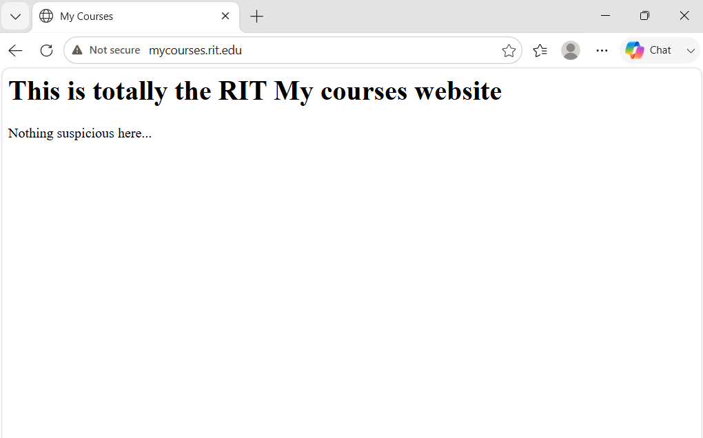
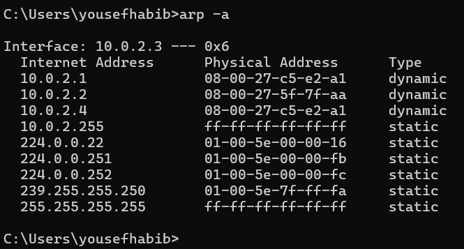
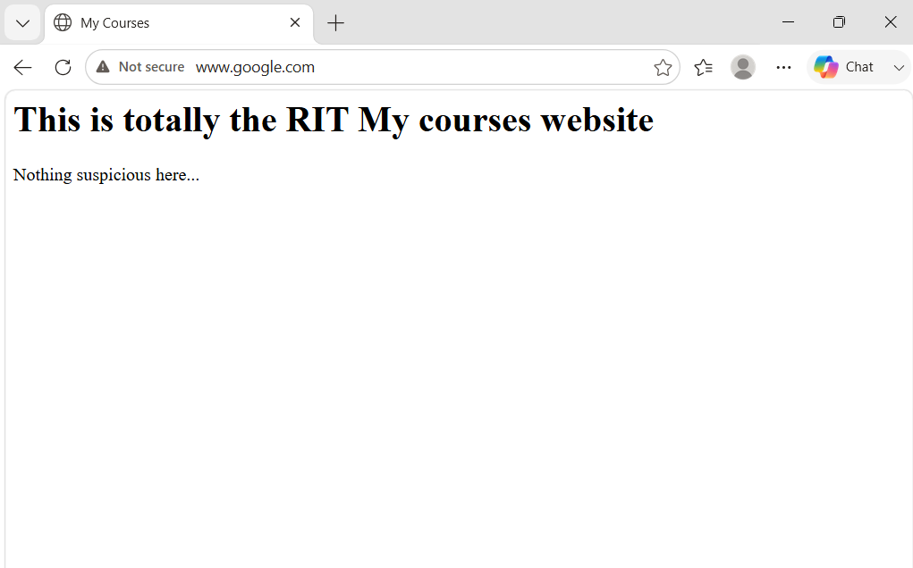

# DNS Spoofing via ARP Spoofing - Home Lab

## Overview
This project demonstrates a DNS spoofing attack using ARP spoofing to perform a Man-in-the-Middle (MitM) attack in a controlled virtual lab environment. The attacker redirects the victim's web traffic to a fake website by poisoning their ARP cache and intercepting DNS requests. The project also demonstrates how HTTPS protects users against this attack.

> ⚠️ **Disclaimer:** This lab was performed in a fully isolated virtual environment for educational purposes only. Never perform these attacks on real networks without explicit written permission.

---

## Lab Environment
| Role | Machine | IP Address |
|------|---------|------------|
| Attacker | Kali Linux (VirtualBox) | 10.0.2.4 |
| Victim | Windows 11 (VirtualBox) | 10.0.2.3 |
| Router | VirtualBox NAT Gateway | 10.0.2.1 |

**Network:** VirtualBox NAT Network (10.0.2.0/24)

**Tools Used:**
- Ettercap 0.8.4
- Python3 (fake web server)
- Nmap
- VirtualBox

---

## How the Attack Works
The attack consists of three layers:

**1. ARP Spoofing (Man-in-the-Middle)**
Every device on a network uses ARP to translate IP addresses to MAC addresses. The attacker sends fake ARP replies to the victim saying "I am the router", causing all victim traffic to flow through the attacker first.

**2. DNS Spoofing**
Once positioned as the man-in-the-middle, the attacker intercepts the victim's DNS requests. When the victim asks "what is the IP of mycourses.rit.edu?", the attacker replies with their own IP instead of the real one.

**3. Fake Website**
The attacker runs a fake webpage on port 80. The victim's browser gets redirected to the attacker's IP and loads the fake site without knowing.

Victim types mycourses.rit.edu
→
DNS request intercepted by Kali
→
Kali replies: mycourses.rit.edu = 10.0.2.4
→
Victim browser connects to 10.0.2.4
→
Kali serves fake website
→
Victim sees fake page without knowing

---

## Attack Walkthrough

### Step 1 - Configure Ettercap DNS File
Added the spoofed DNS entry to ettercap's dns file:
mycourses.rit.edu A 10.0.2.4

### Step 2 - Enable IP Forwarding
Enabled IP forwarding on Kali so traffic continues to flow through to the real router, keeping the attack invisible:
```bash
sudo sysctl -w net.ipv4.ip_forward=1
```

### Step 3 - Start Fake Website
Ran a Python web server on port 80 serving the fake MyCourses page:
```bash
sudo python3 site.py
```

### Step 4 - Launch ARP Spoofing + DNS Spoof
```bash
sudo ettercap -T -M arp:remote /10.0.2.3// /10.0.2.1// -P dns_spoof -i eth0
```
**Command breakdown:**
- `-T` — text mode interface
- `-M arp:remote` — Man-in-the-Middle via ARP spoofing
- `/10.0.2.3//` — victim IP
- `/10.0.2.1//` — router IP
- `-P dns_spoof` — load the DNS spoofing plugin
- `-i eth0` — network interface to use

### Step 5 - Verify DNS Spoof Worked
On the victim machine, nslookup confirmed the spoof:
nslookup mycourses.rit.edu
Address: 10.0.2.4

### Step 6 - Victim Gets Redirected
The victim typed `mycourses.rit.edu` in their browser and landed on the fake website.



### Step 7 - ARP Table Confirms Poisoning
Running `arp -a` on the victim machine after the attack showed that the router's MAC address had changed to match Kali's MAC address — proving the ARP poisoning was successful.



---

## Defense Demonstration

### Defense 1 - HTTPS Protects Against DNS Spoofing
When the attack was performed against an HTTPS site (`https://www.google.com`), the connection was refused entirely. This is because the attacker cannot forge a valid SSL certificate for google.com. The browser refuses to connect rather than loading a fake page.

**HTTP site:** Victim gets redirected to fake site with no warning ❌


**HTTPS site:** Connection refused, victim is protected ✅


### Defense 2 - Static ARP Entries
Adding a static ARP entry for the router prevents the ARP cache from being poisoned:
```cmd
arp -s 10.0.2.1 [router-mac-address]
```
A static entry cannot be overwritten by fake ARP replies, breaking the man-in-the-middle position entirely.
